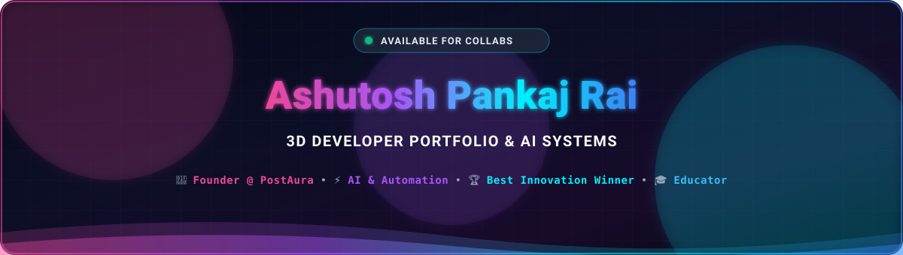

<div align="center">


  


  <a href="https://github.com/Ashurai84">
    
  </a>

  <br /><br />


  <p align="center">
    <a href="https://postaura.dev/" target="_blank">
      
    </a>
    <a href="https://linkedin.com/in/ashutosh-pankaj-rai" target="_blank">
      
    </a>
    <a href="mailto:Ashutoshrai.contact@gmail.com">
      
    </a>
    <a href="https://github.com/Ashurai84">
      
    </a>
  </p>

  <p align="center">
    
    
    
    
    
  </p>

</div>

---

### 🌟 Portfolio Highlights & Key Modules

| Module | Core Technology | Description |
| :--- | :--- | :--- |
| **🌌 3D Hero Constellation** | `Three.js` `@react-three/fiber` | Interactive planetary orbit with laser connections, reactive mouse tracking, and dual workstation modes (`🤖 AI Ecosystem` / `🖥️ 3D Workstation`). |
| **🏆 Live Proof & Honors** | `Framer Motion` `Tailwind CSS` | Verified achievement highlights including the **Best Innovation Award** at *Hack With Mumbai 2.0* and the **GitHub Invertocat Gold Pin** from *Microsoft Fabric IQ*. |
| **🚀 Production Projects** | `React` `Next.js` `Gemini API` | Interactive showcase featuring live products: **PostAura**, **Sahayak**, **Krishi Officer**, and **ASR LABS**. |
| **🎓 Mentorship & Workshops** | `Full-Stack Architecture` | Documented masterclasses conducted for MBA & BBA students on AI automation and n8n workflow engineering. |
| **📄 Interactive Resume System** | `React State` `Blob Streaming` | Built-in PDF reader with simulated cryptographic download progress telemetry. |

---

### 🛠️ Technical Stack & Architecture

<div align="center">

#### 💻 Programming Languages
<p align="center">
  
  
</p>

#### 🎨 3D, Frontend & Creative Engineering
<p align="center">
  
</p>

#### ⚙️ Backend, Systems & Cloud Infrastructure
<p align="center">
  
</p>

#### 🧠 AI, Automation & Agentic Protocols
<p align="center">
  
  
  
  
</p>

</div>

---

### 🚀 Featured Products & Systems

```
📦 PostAura             ➔  AI LinkedIn Writing Workspace & Antigravity Scoring Engine
📦 Sahayak              ➔  Multimodal Emergency Assistive Platform (Hackathon Winner)
📦 Krishi Officer       ➔  Computer Vision Crop Disease & Telemetry Advisory Engine
📦 ASR LABS             ➔  Live Architecture Decision Records & Agent Telemetry Portal
📦 Smart Home IoT       ➔  Role-based MERN IoT Appliance Dashboard & Audit Logger
```

<br />

| Project | Stack | Highlights | Links |
| :--- | :--- | :--- | :---: |
| **PostAura** | `Next.js 14` `Gemini API` `TypeScript` `Tailwind` | Intelligent post rewriting with tone preservation and algorithm hook score evaluator. | [🌐 Live Product](https://postaura.dev/) • [📦 GitHub](https://github.com/Ashurai84/Post-Aura) |
| **Sahayak** | `React` `Node.js` `Express` `MongoDB` | AI emergency accessibility & safety platform (*Best Innovation Award Winner*). | [🏆 Award Post](https://www.linkedin.com/posts/ashutosh-pankaj-rai_bestinnovationaward-hackwithmumbai-bombaybytes-activity-7427016824233549824-EEZ2) • [📦 GitHub](https://github.com/Ashurai84) |
| **Krishi Officer** | `React` `Claude Vision` `Tailwind` `Vercel` | Real-time crop blight diagnosis scanner and weather-driven irrigation schedule generator. | [🌐 Live Demo](https://krishi-officer.vercel.app/) • [📦 GitHub](https://github.com/Ashurai84/Krishi_officer) |
| **ASR LABS** | `Next.js` `MCP` `TypeScript` `Agentic AI` | Live engineering telemetry tracking autonomous agents and architectural records. | [🌐 Live Demo](https://asr-labs.vercel.app/) • [📦 GitHub](https://github.com/Ashurai84) |

---

### 📂 Repository Structure

```tree
Ashutosh_Portfolio/
├── public/
│   ├── desktop_pc/        # 3D workstation glTF model assets
│   ├── planet/            # 3D planet orbit glTF model assets
│   ├── Ashutosh.pdf       # Verified developer resume
│   └── favicon.ico        # Cyberpunk themed site icon
├── src/
│   ├── assets/            # Project screenshots, company & tech logos
│   ├── components/
│   │   ├── canvas/        # Three.js 3D canvas components & shaders
│   │   ├── hero.tsx       # 3D Holographic hero with interactive orbital nodes
│   │   ├── about.tsx      # Overview & professional philosophy
│   │   ├── experience.tsx # Engineering timeline & verified roles
│   │   ├── works.tsx      # Interactive 3D tilt project cards
│   │   ├── achievements.tsx # Hackathon awards & enterprise AI pins
│   │   ├── teaching.tsx   # MBA & BBA workshop masterclasses
│   │   └── contact.tsx    # Cyberpunk terminal contact form
│   ├── constants/         # Centralized portfolio data & metadata configuration
│   └── styles.ts          # Unified responsive layout styles
├── package.json           # Dependencies & build scripts
└── vite.config.ts         # Vite build configuration
```

---

### 💻 Quick Start & Local Setup

```bash
# 1. Clone the repository
git clone https://github.com/Ashurai84/Ashutosh_Portfolio.git

# 2. Enter workspace directory
cd Ashutosh_Portfolio

# 3. Install project dependencies
npm install

# 4. Launch local development server
npm run dev
```

The portfolio will be running locally at `http://localhost:5174/`.

```bash
# To generate an optimized production bundle:
npm run build
```

---

### 🌐 Connect With Me

<div align="center">

<a href="https://linkedin.com/in/ashutosh-pankaj-rai" target="_blank">
  
</a>
&nbsp;
<a href="https://github.com/Ashurai84" target="_blank">
  
</a>
&nbsp;
<a href="mailto:Ashutoshrai.contact@gmail.com">
  
</a>
&nbsp;
<a href="https://postaura.dev/" target="_blank">
  
</a>

<br /><br />

<!-- Profile Views Badge -->


</div>

---

<div align="center">

  <!-- Bottom Wave Divider (Local SVG) -->
  

  <sub>Crafted with passion & engineering precision by <b>Ashutosh Pankaj Rai</b> • Built with React, TypeScript & Three.js 🚀</sub>

</div>
